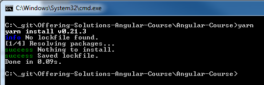

# Offering Solutions Angular Course (OSAC) Preparations

## Things you need to bring to get started with the course

1. Dropbox - Account
2. PC / Laptop (if the course is done via Digicomp PCs are already there and you are good to go)
3. Enthusiasm and the will to learn something new :-)

# Preparation

### If you come with your own laptop please make sure you installed the following pices of software to your PC:

* [Git](#git)
* [Node & npm](#node-with-npm)
* [Typescript](#typescript)
* [Yarn (not necessary)](#yarn)
* [Visual Studio Code](#visual-studio-code)

## Git

You can get git on [https://git-scm.com/downloads](https://git-scm.com/downloads) and check if you installed git via typing 

`git`

on your commandline. Something like this should appear:

## Node with npm

You can get node at [https://nodejs.org/en/download/](https://nodejs.org/en/download/) and install it normally. After doing this make sure you can type

`node -v`

and

`npm -v`

on your console.

> The versions do not really matter at all but be sure that node version is greater than version 6!

## Typescript

You can get Typescript on [https://www.typescriptlang.org/#download-links](https://www.typescriptlang.org/#download-links) or by directly typing 

`npm install -g typescript`

on your commandline.

Please make sure that afterwards you are able to type

`tsc -v`

on your commandline seeing something like this:

## Yarn (not necessary but nice to have)

You can get Yarn on [https://yarnpkg.com/en/docs/install](https://yarnpkg.com/en/docs/install). Please follow the installation instructions there.

Please make sure that afterwards you are able to type

`yarn`

on your commandline seeing something like this:

Do not be scared about the error. We will explain everything about that in the course.

## Visual Studio Code

Generally you can use every text editor you want to implement Angular applications. We will use Visual Studio Code in this course. We will do an introduction to this editor and extend it with useful plugins to make our dev life a little easier.

> Please check the checkboxes highlighted here. It makes your life easier:

 

You can download Visual Studio Code from [https://code.visualstudio.com/](https://code.visualstudio.com/)
