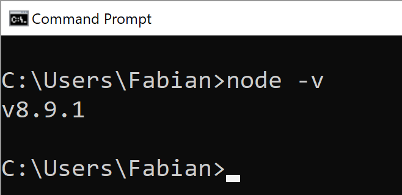
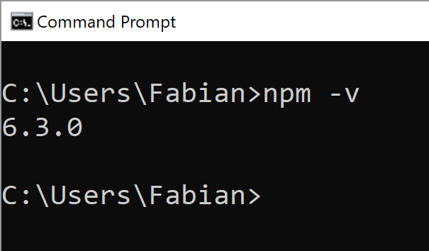
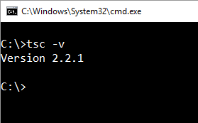
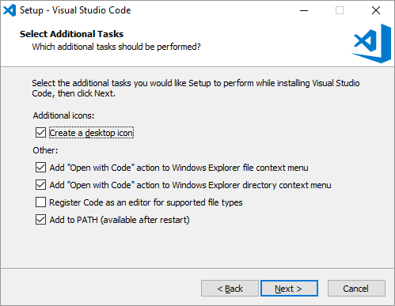

# [Offering Solutions](https://offering.solutions/) Angular Course (OSAC)

  

This repository contains material for getting started with Angular. It should provide a code base where you can start on learning or teaching Angular.

[Twitter](https://twitter.com/FabianGosebrink/)

## Demo Application

[Demo](http://foodapiui.azurewebsites.net/)

## Offering Solutions Angular Course

If you are attending the course you are ready to dive into the following chapters with us

1. [Angular Start](https://github.com/OfferingSolutions/Offering-Solutions-Angular-Course/tree/master/Angular-Course/00_AngularStart)
2. [Components Part I](https://github.com/OfferingSolutions/Offering-Solutions-Angular-Course/tree/master/Angular-Course/01_Components_Part_I)
3. [Directives](https://github.com/OfferingSolutions/Offering-Solutions-Angular-Course/tree/master/Angular-Course/02_Directives)
4. [Components Part II](https://github.com/OfferingSolutions/Offering-Solutions-Angular-Course/tree/master/Angular-Course/03_Components_Part_II)
5. [Lifecycle](https://github.com/OfferingSolutions/Offering-Solutions-Angular-Course/tree/master/Angular-Course/04_Lifecycle)
6. [Observables](https://github.com/OfferingSolutions/Offering-Solutions-Angular-Course/tree/master/Angular-Course/05_Observables)
7. [Services](https://github.com/OfferingSolutions/Offering-Solutions-Angular-Course/tree/master/Angular-Course/06_Services)
8. [Dependency Injection](https://github.com/OfferingSolutions/Offering-Solutions-Angular-Course/tree/master/Angular-Course/07_DependencyInjection)
9. [Pipes](https://github.com/OfferingSolutions/Offering-Solutions-Angular-Course/tree/master/Angular-Course/08_Pipes)
10. [Forms](https://github.com/OfferingSolutions/Offering-Solutions-Angular-Course/tree/master/Angular-Course/09_Forms)
11. [Routing](https://github.com/OfferingSolutions/Offering-Solutions-Angular-Course/tree/master/Angular-Course/10_Routing)
12. [Modules](https://github.com/OfferingSolutions/Offering-Solutions-Angular-Course/tree/master/Angular-Course/11_Modules)
13. [Testing](https://github.com/OfferingSolutions/Offering-Solutions-Angular-Course/tree/master/Angular-Course/12_Testing)
14. [Webpack](https://github.com/OfferingSolutions/Offering-Solutions-Angular-Course/tree/master/Angular-Course/13_Webpack)

# Preparation

See the instructions to get started

## Things you need to bring to get started with the course

1. Dropbox - Account
2. PC / Laptop
3. Enthusiasm and the will to learn something new :-)

### If you come with your own laptop please make sure you installed the following pieces of software to your PC:

* [Git](#git)
* [Node & npm](#node-with-npm)
* [Typescript](#typescript)
* [Visual Studio Code](#visual-studio-code)

## Git

You can get git on [https://git-scm.com/downloads](https://git-scm.com/downloads) and check if you installed git via typing 

`git`

on your commandline. Something like this should appear:

## Node with npm

You can get node at [https://nodejs.org/en/download/](https://nodejs.org/en/download/) and install it normally. After doing this make sure you can type

`node -v`

and

`npm -v`

on your console.

> The versions do not really matter at all but be sure that node version is greater than version 6!

## Typescript

You can get Typescript on [https://www.typescriptlang.org/#download-links](https://www.typescriptlang.org/#download-links) or by directly typing 

`npm install -g typescript`

on your commandline.

Please make sure that afterwards you are able to type

`tsc -v`

on your commandline seeing something like this:

## Visual Studio Code

Generally you can use every text editor you want to implement Angular applications. We will use Visual Studio Code in this course. We will do an introduction to this editor and extend it with useful plugins to make our dev life a little easier.

> Please check the checkboxes highlighted here. It makes your life easier:

 

You can download Visual Studio Code from [https://code.visualstudio.com/](https://code.visualstudio.com/)
